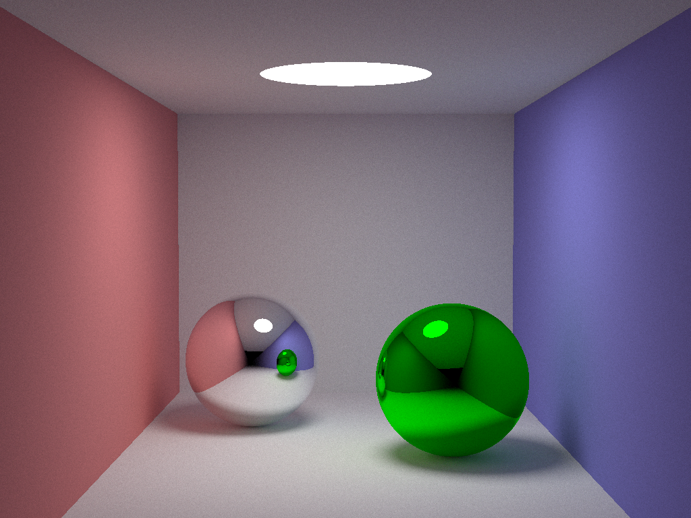
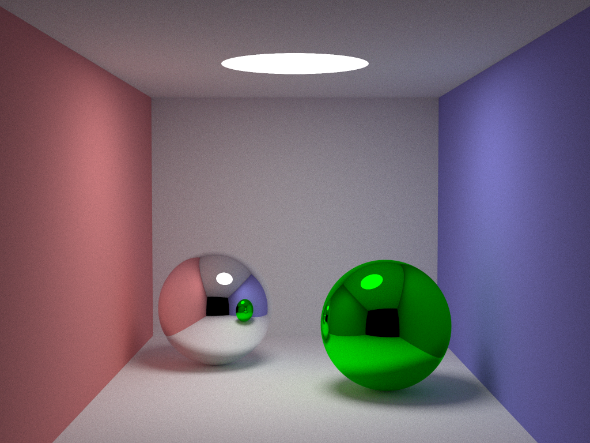
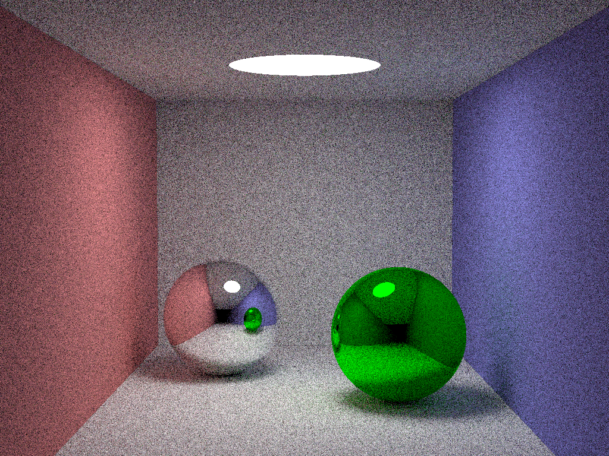
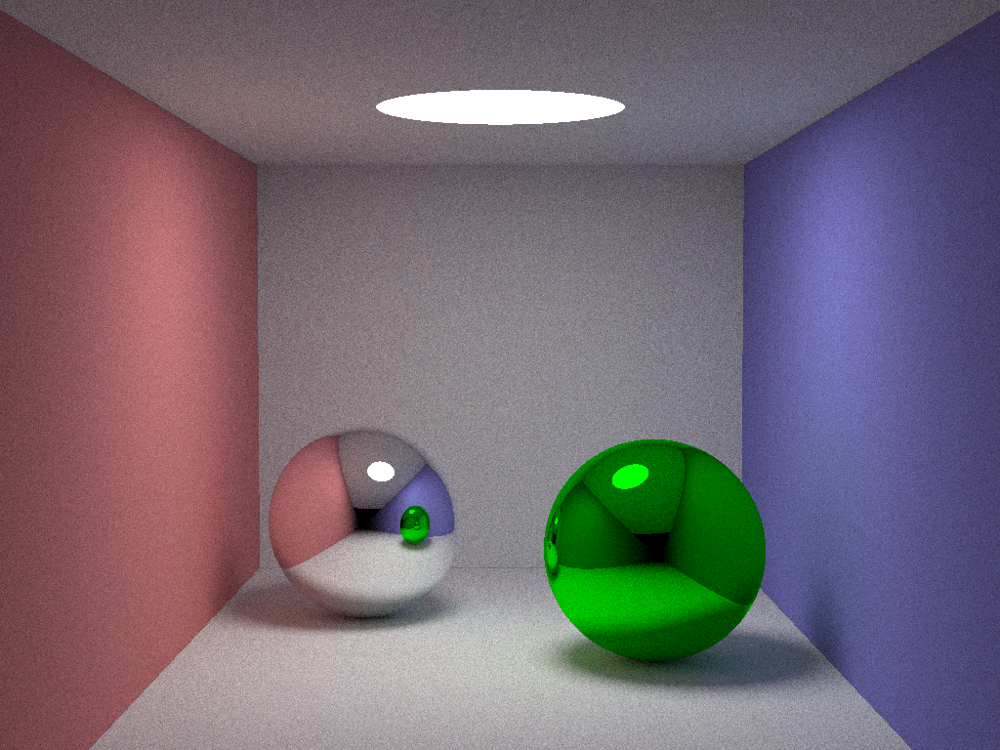
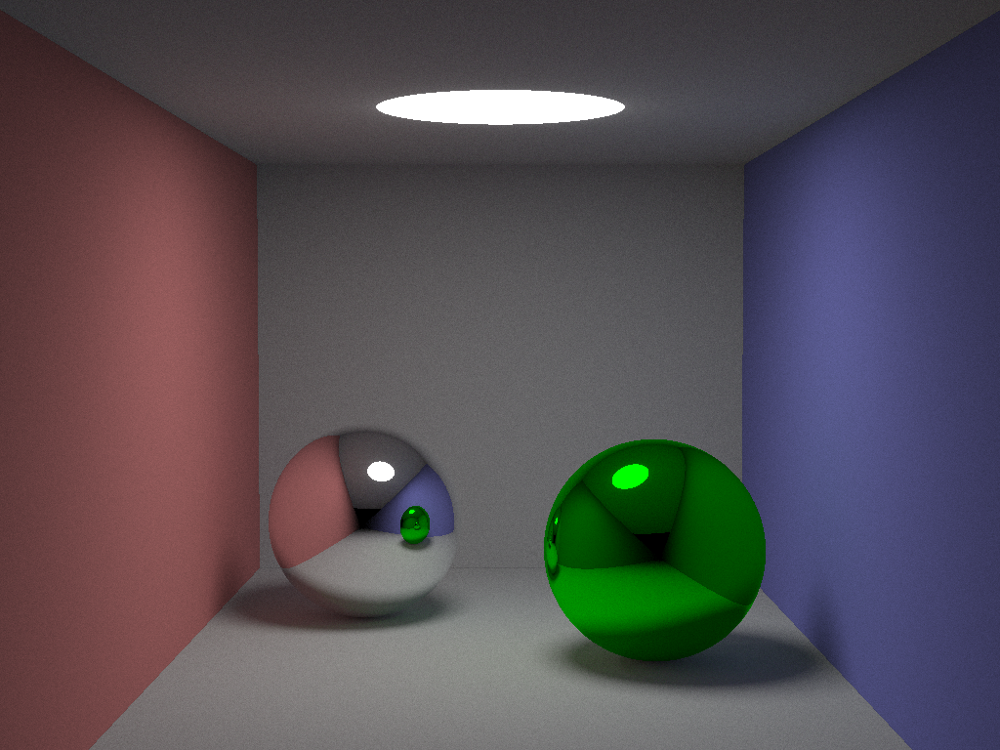
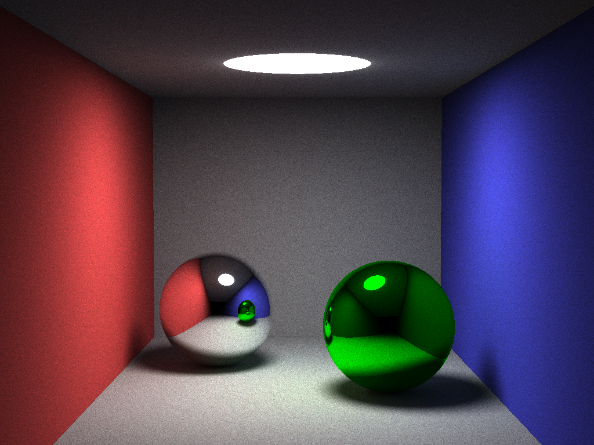

# Raytracing

An attempt to implement relevant raytracing techniques.

### Disclaimer

I do not claim ownership of any content in this project. Its sole purpose is replicating and learning relevant raytracing techniques. There are parts that were simply copy-pasted from elsewhere for convenience.

Most importantly, I was inspired by Kevin Beason's [smallpt](http://www.kevinbeason.com/smallpt/) which bundles together many relevant raytracing techniques in an impressive 99 lines of C++ code. In this project here, I basically replicated [smallpt](http://www.kevinbeason.com/smallpt/) step by step in my own way of coding by closely analyzing [smallpt](http://www.kevinbeason.com/smallpt/) and with other sources all listed below.

#### Techniques learned and replicated

Anti-Aliasing via Supersampling with Importance-Sampled Tent Distribution, from [smallpt](http://www.kevinbeason.com/smallpt/) and the [presentation slides about smallpt](https://drive.google.com/file/d/0B8g97JkuSSBwUENiWTJXeGtTOHFmSm51UC01YWtCZw/view) by David Cline

Russian Roulette, from [this answer](https://computergraphics.stackexchange.com/a/2325) and [smallpt](http://www.kevinbeason.com/smallpt/)

Importance Sampling of a Cosine-Weighted Hemisphere, from [rorydriscoll.com](http://www.rorydriscoll.com/2009/01/07/better-sampling/)

Gamma Correction, from [smallpt](http://www.kevinbeason.com/smallpt/) (and the German Wikipedia has short and good explanations [here](https://de.wikipedia.org/wiki/Gammakorrektur))

Uniform Sampling of a Hemisphere, from [scratchapixel.com](https://www.scratchapixel.com/lessons/3d-basic-rendering/global-illumination-path-tracing/global-illumination-path-tracing-practical-implementation)

Monte Carlo Path Tracing, from [scratchapixel.com](https://www.scratchapixel.com/lessons/3d-basic-rendering/global-illumination-path-tracing) and [smallpt](http://www.kevinbeason.com/smallpt/)

Phong Shading, known from my studies in advance

Ray-Sphere Intersection, from [scratchapixel.com](https://www.scratchapixel.com/lessons/3d-basic-rendering/minimal-ray-tracer-rendering-simple-shapes/ray-sphere-intersection)

#### History

##### 10.09.17 - [7497bdf](https://github.com/Raccok/Raytracing/commit/7497bdfc3c853f19063a6223b7bf1dd5a790f9bf)

Added supersampling as done in [smallpt](http://www.kevinbeason.com/smallpt/) as an anti-aliasing technique. This significantly improved the image quality by smoothing all edges. Note that I also added a black front side to the room in this step (as done in [smallpt](http://www.kevinbeason.com/smallpt/)) which basically limits/decreases the room depth, but this is a minor detail.

| without supersampling | with supersampling |
| --- | --- |
|  |  |

##### 08.09.17 - [373ce2e](https://github.com/Raccok/Raytracing/commit/373ce2efb3bab9fc36a0c3159aa2e473f44d7df9)

Added Russian Roulette to randomly terminate a traced path. This makes the Monte Carlo integration (mathematically) unbiased ([source](https://computergraphics.stackexchange.com/questions/2316/is-russian-roulette-really-the-answer)). Ultimately, this technique allows a raytracer to include more (meaningful) radiance contributions in a traced path without much extra computational costs. Achieved improvements are shown below.

| fixed path termination after 5 bounces | random path termination with Russian Roulette |
| --- | --- |
|  |  |

The differences are subtle but important nonetheless. In a close side by side comparison, you can see that the shadows are generally a bit brighter with Russian Roulette, because of the increased number of radiance contributions in each traced path. Also, for the same reason, the shadows below the balls received more reflected radiance from nearby surfaces and the surfaces' respective color is more visible at these areas.

##### 02.09.17 - [c68371c](https://github.com/Raccok/Raytracing/commit/c68371c64de21c6c3c7bb046d9ab350c5c9aaeeb)

Added the gamma correction of 2.2 from [smallpt](http://www.kevinbeason.com/smallpt/). Finally, my images are as bright as [smallpt](http://www.kevinbeason.com/smallpt/)'s, I've been wondering why they weren't.

Added importance sampling with a cosine-weighted hemisphere. This is a pretty big step. First, I finally understood why [smallpt](http://www.kevinbeason.com/smallpt/) does not include Lambert's cosine law or a PDF explicitly. Both coefficients are included, of course, but the terms cancel each other out pretty nicely in the Monte Carlo integration. Then, rendering with the same amount of samples leads to significantly better results. This is the main advantage of choosing importance sampling over uniform sampling. The table below shows the achieved improvements.

| # samples per pixel | with uniform sampling | with importance sampling |
| --- | --- | --- |
| both 100 |  |  |
| both 1000 |  |  |
| 10000 vs 5000 |  |  |

Importance sampling achieves significantly less noise with the same number of samples. Also, 5000 samples per pixel with importance sampling generate an image similar to, or even better than, 10000 samples per pixel with uniform sampling in terms of visual quality. Ultimately, it saves half the computation time in this case.

##### 01.09.17 - [5a9d338](https://github.com/Raccok/Raytracing/commit/5a9d338094ff9647784379e12eb7bc9f98e4588b)

After quite a lot of experimenting and analyzing the implementations of [smallpt](http://www.kevinbeason.com/smallpt/) and [scratchapixel.com](https://www.scratchapixel.com/lessons/3d-basic-rendering/global-illumination-path-tracing/global-illumination-path-tracing-practical-implementation), I feel confident in understanding the practice of Monte Carlo path tracing. Multiple ray bounces allow for indirect lighting and adding explicit direct or ambient lighting is no longer necessary. Also, they make rendering ideal specular surfaces pretty simple. The image below was again rendered with 10000 samples per pixel and each sample ray bounced 5 times after it hit a diffuse surface for the first time. As expected, rendering this image was about 5 times slower than rendering the image before, since the runtime is pretty much linear in the number of ray bounces.

##### 22.08.17 - [eb84f2d](https://github.com/Raccoh/Raytracing/commit/eb84f2d8f7b343c95868c33bb0eca853502302b6)

Managed to render the [smallpt](http://www.kevinbeason.com/smallpt/) scene with an area light source. This setup uses very basic Monte Carlo path tracing where the rays only bounce once. Still, it generates soft shadows visible on the floor in the image below which was rendered with 10000 samples per pixel.

##### 20.08.17 - [891110b](https://github.com/Raccoh/Raytracing/commit/891110b02f9926885299386a17b7afb66754d785)

Managed to render the [smallpt](http://www.kevinbeason.com/smallpt/) scene with a point light source (instead of an area light source) and diffuse lighting plus hard shadows as a start. Most of this practice was known from my studies in advance.

