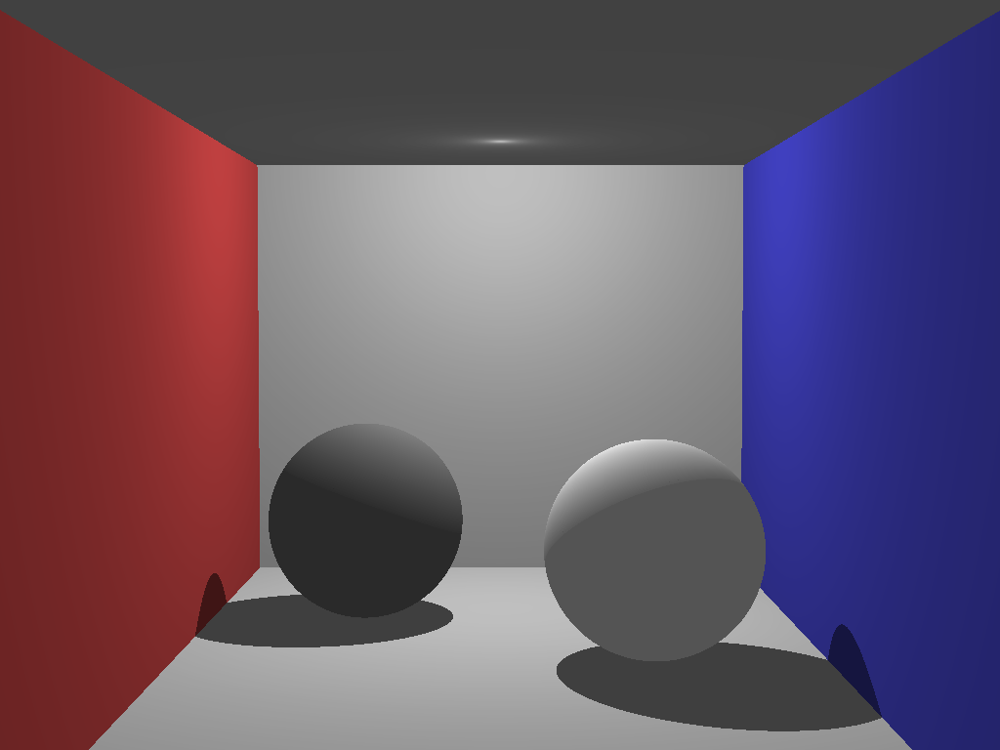

# Raytracing

An attempt to implement modern raytracing techniques.

### Disclaimer

I do not claim ownership of any content in this project. Its sole purpose is replicating and learning modern raytracing techniques. There are parts that were simply copy-pasted from elsewhere for convenience.

Most importantly, I was inspired by Kevin Beason's [smallpt](http://www.kevinbeason.com/smallpt/).

#### Techniques learned and replicated

Ray-Sphere Intersection, from [scratchapixel.com](https://www.scratchapixel.com/lessons/3d-basic-rendering/minimal-ray-tracer-rendering-simple-shapes/ray-sphere-intersection)

Phong Shading, known from my studies in advance

#### History

##### 20.08.17

Managed to render the [smallpt](http://www.kevinbeason.com/smallpt/) scene with a point light source (instead of an area light source) and only diffuse lighting plus hard shadows as a start. Most of this practice was known from my studies in advance.

