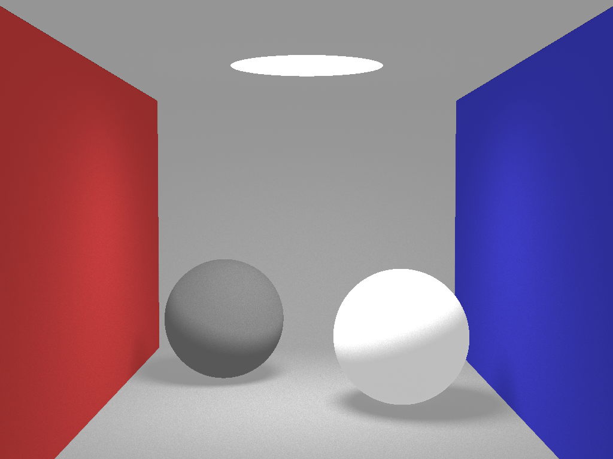
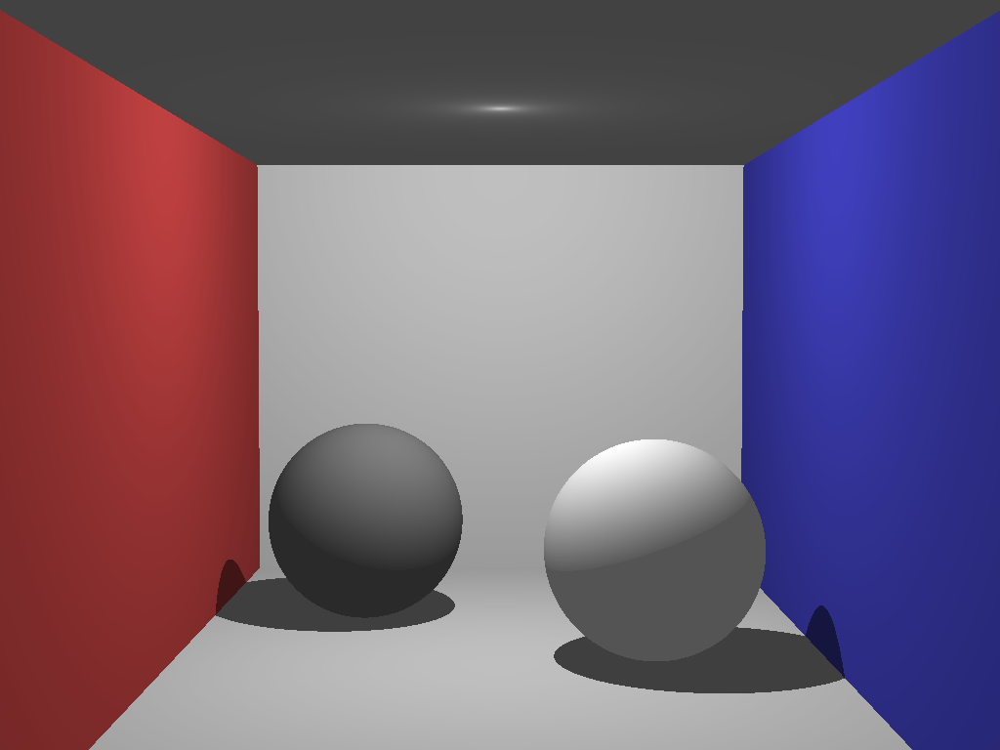

# Raytracing

An attempt to implement modern raytracing techniques.

### Disclaimer

I do not claim ownership of any content in this project. Its sole purpose is replicating and learning modern raytracing techniques. There are parts that were simply copy-pasted from elsewhere for convenience.

Most importantly, I was inspired by Kevin Beason's [smallpt](http://www.kevinbeason.com/smallpt/).

#### Techniques learned and replicated

Monte Carlo Path Tracing, from [scratchapixel.com](https://www.scratchapixel.com/lessons/3d-basic-rendering/global-illumination-path-tracing)

Phong Shading, known from my studies in advance

Ray-Sphere Intersection, from [scratchapixel.com](https://www.scratchapixel.com/lessons/3d-basic-rendering/minimal-ray-tracer-rendering-simple-shapes/ray-sphere-intersection)

#### History

##### 22.08.17 - [eb84f2d](https://github.com/Raccoh/Raytracing/commit/eb84f2d8f7b343c95868c33bb0eca853502302b6)

Managed to render the [smallpt](http://www.kevinbeason.com/smallpt/) scene with an area light source. This setup uses very basic Monte Carlo path tracing where the rays only bounce once. Still, it generates soft shadows visible on the floor in the image below which was rendered with 10000 samples per pixel.

##### 20.08.17 - [891110b](https://github.com/Raccoh/Raytracing/commit/891110b02f9926885299386a17b7afb66754d785)

Managed to render the [smallpt](http://www.kevinbeason.com/smallpt/) scene with a point light source (instead of an area light source) and diffuse lighting plus hard shadows as a start. Most of this practice was known from my studies in advance.

